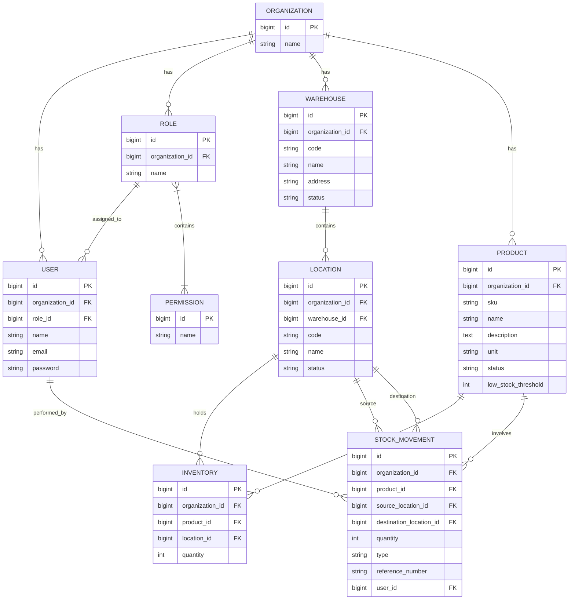

# Warehouse Management System (WMS) - Laravel

## 📖 Project Introduction
This is a robust and scalable Warehouse Management System (WMS) built with the Laravel framework. The system is designed to manage multiple organizations and warehouses, tracking inventory, products, and stock movements efficiently. It features a role-based access control (RBAC) system for users within each organization, allowing for secure and precise permission management. Key features include tracking products across different locations in warehouses, monitoring inventory levels, and recording every stock movement (receive, transfer, dispatch).

## 🚀 Project Run and Setup (Fully Dockerized)

This project is fully Dockerized for local development and deployment. Follow these steps to set up and run the project using Docker Compose:

1. **Clone the repository:**
   ```bash
   git clone <repository-url>
   cd wms_laravel
   ```

2. **Environment Setup:**
   Copy the `.env.example` to `.env` and configure your environment variables (e.g., `DB_HOST=db`, `DB_USERNAME`, `DB_PASSWORD`) to match your Docker setup.
   ```bash
   cp .env.example .env
   ```

3. **Build and Start the Docker Containers:**
   Build the Docker images and start all services (app, db, web server, etc.) in the background:
   ```bash
   docker-compose up -d --build
   ```

4. **Install Dependencies:**
   Install the PHP dependencies via Composer inside the application container (assuming the service is named `app`):
   ```bash
   docker-compose exec app composer install
   ```

5. **Generate Application Key:**
   ```bash
   docker-compose exec app php artisan key:generate
   ```

6. **Database Migration and Seeding:**
   Run the database migrations and seed the initial data:
   ```bash
   docker-compose exec app php artisan migrate --seed
   ```
   The application will now be accessible at `http://localhost:8000` (or the port defined in your `docker-compose.yml`).

7. **Run Tests:**
   Execute the automated test suite (Feature and Unit tests) inside the container:
   ```bash
   docker-compose exec app php artisan test
   ```

## 📁 Project Structure

The project follows standard Laravel conventions with some specific domains for WMS features:

```text
wms_laravel/
├── app/
│   ├── Http/
│   │   ├── Controllers/    # API and Web controllers
│   │   ├── Requests/       # Form request validation
│   │   └── Middleware/     # Custom middleware (e.g., RBAC, Tenancy)
│   ├── Models/             # Eloquent Models (User, Organization, Warehouse, Product, etc.)
│   └── Providers/          # Service Providers
├── database/
│   ├── migrations/         # Database schema definitions
│   ├── seeders/            # Database seeders for initial data
│   └── factories/          # Model factories for testing
├── routes/
│   ├── api.php             # API endpoints
│   └── web.php             # Web routes
├── tests/                  # PHPUnit test cases
│   ├── Feature/            # API endpoint testing & business logic
│   └── Unit/               # Unit testing for classes/methods
└── ...
```

## 📊 Database ERD Diagram

Below is the Entity Relationship Diagram (ERD) based on the database migrations:



## 🧪 How to Test and Check API

1. **Swagger Documentation:** 
   - Interactive API documentation is available via Swagger UI. 
   - Once the application is running, navigate to: `http://localhost:8000/api/documentation` to explore and test all available endpoints directly from your browser.
2. **API Client:** Use tools like [Postman](https://www.postman.com/), [Insomnia](https://insomnia.rest/), or Thunder Client (VS Code Extension).
3. **Authentication:** 
   - Send a `POST` request to `/api/v1/auth/login` with your credentials (e.g., email and password).
   - Copy the `access_token` from the response.
   - For all subsequent requests, add the token to the Headers: `Authorization: Bearer <your_access_token>`.
4. **Headers:** Always include the following header for manual API requests:
   - `Accept: application/json`
5. **Testing Endpoints:**
   - Example to get products: `GET http://localhost:8000/api/v1/products`
   - Example to record stock receiving: `POST http://localhost:8000/api/v1/inventory/receive` with appropriate JSON body.
6. **Automated Testing:** As mentioned in the setup, you can run `docker-compose exec app php artisan test` to verify API endpoints and business logic programmatically.
